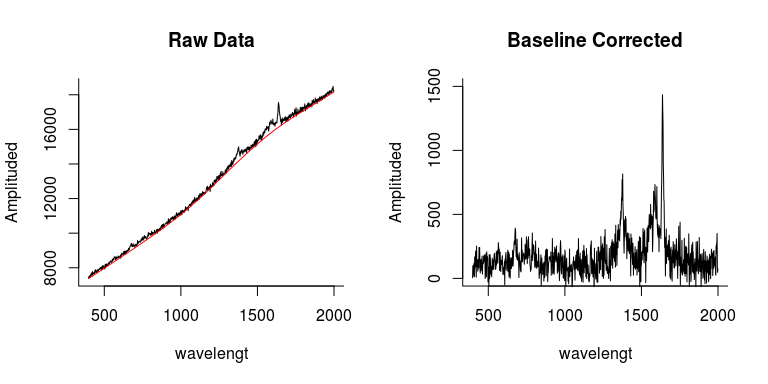
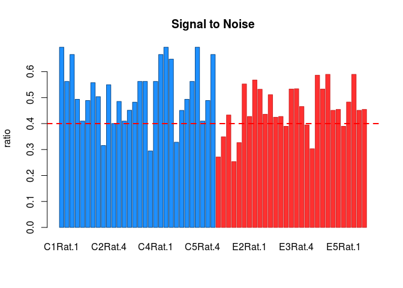
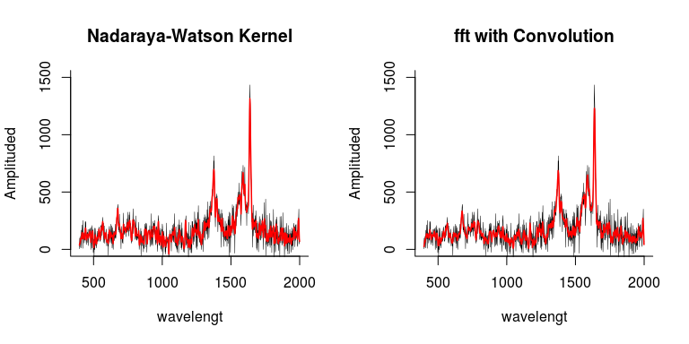
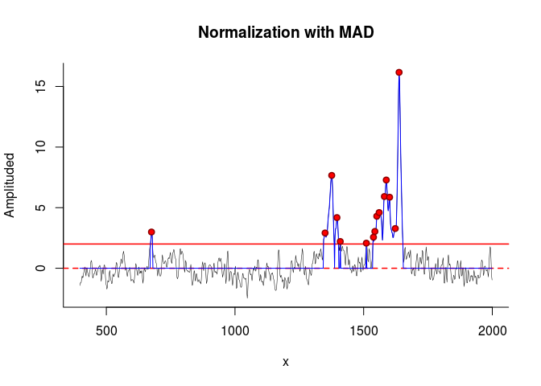
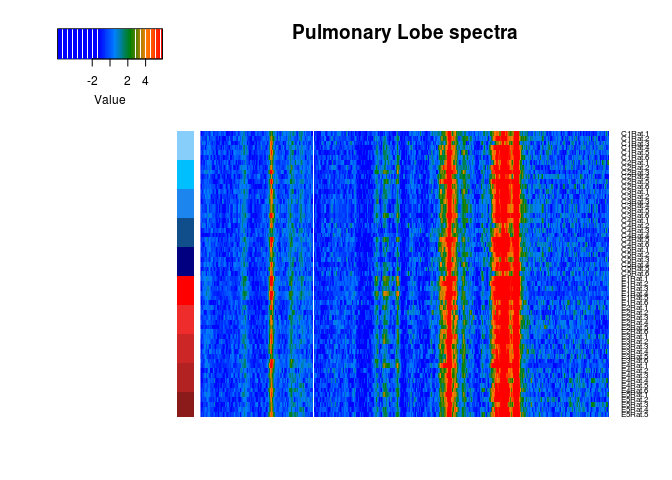
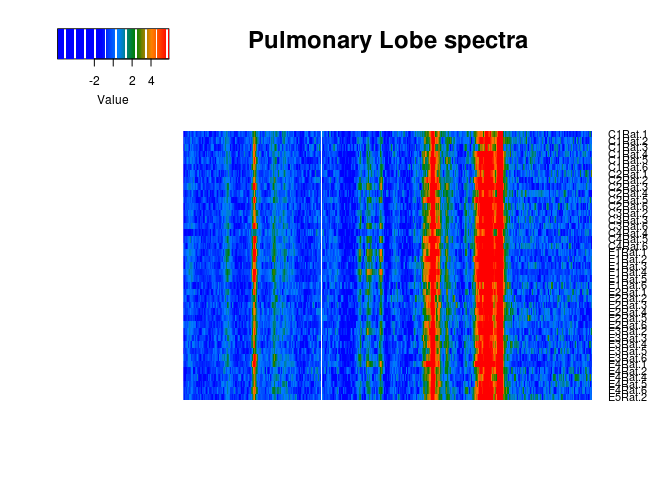
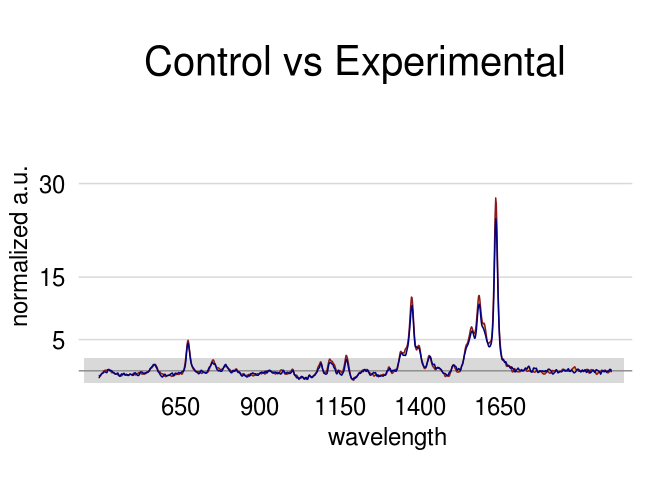

-   [Step 1: Data reading & ordering](#step-1-data-reading-ordering)
-   [Step 2: Baseline Correction](#step-2-baseline-correction)
-   [Step 3: Signal to Noise Ratio](#step-3-signal-to-noise-ratio)
-   [Step 4: Smoothing of the signal](#step-4-smoothing-of-the-signal)
-   [Step 5: Normalization of the data & Peak detection](#step-5-normalization-of-the-data-peak-detection)
-   [Step 6: Data Visualization](#step-6-data-visualization)
    -   [Heatmap of all cases](#heatmap-of-all-cases)
    -   [Detection of duplicated data & Heatmap of Non-duplicated data](#detection-of-duplicated-data-heatmap-of-non-duplicated-data)
-   [Step 7: Spectral Comparison](#step-7-spectral-comparison)

Step 1: Data reading & ordering
===============================

The first steps only uploads the `xlsx` file and concatenates each sheet into one woorkbook.

    ## [1] "READING sheet 1 ..."
    ## [1] "READING sheet 2 ..."
    ## [1] "READING sheet 3 ..."
    ## [1] "READING sheet 4 ..."
    ## [1] "READING sheet 5 ..."
    ## [1] "READING sheet 6 ..."
    ## [1] "READING sheet 7 ..."
    ## [1] "READING sheet 8 ..."
    ## [1] "READING sheet 9 ..."
    ## [1] "READING sheet 10 ..."

Step 2: Baseline Correction
===========================

Baseline is corrected with a 2nd derivative constrained weighted regression. It was the optimal method provided from the package `baseline` from R.
The next two graphs show the raw data of Control.1-area.1 on the left with the baseline fitted (red line) and the baseline fitted on the right.

Step 3: Signal to Noise Ratio
=============================

The SNR was caculated here in case is needed for further analysis, as a cofounding variable, as a set up for smothing or just as quality control check point. Blue are control cases, red experimental.

Step 4: Smoothing of the signal
===============================

Two options here the Nadayara-Watson Kernel or a fast furier transformation with convolution.
The smoothing of the signal is made in order to improve the SNR.

Step 5: Normalization of the data & Peak detection
==================================================

This is done in two steps first we normalized all data to the Mean Absolute Deviation (MAD) and then we search those peaks that are above 2 standart deviation of the MAD. 

Step 6: Data Visualization
==========================

### Heatmap of all cases

### Detection of duplicated data & Heatmap of Non-duplicated data

#### Control vs Experiment spectra

Step 7: Spectral Comparison
===========================

... working on the theory ....
